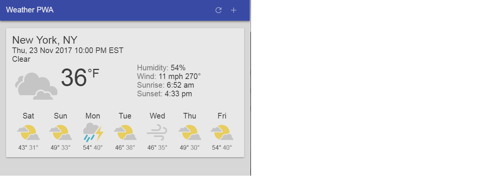

# Weather PWA
> These are the source code files my [Weather Progressive Web App](https://weather-pwa-8a89a.firebaseapp.com/).

[![NPM Version][npm-image]][npm-url]
[![Build Status][travis-image]][travis-url]
[![Downloads Stats][npm-downloads]][npm-url]

This is a work in progress, if you find a mistake, please [file an issue](https://github.com/agungsantoso/Weather-PWA/issues). Thanks!

## Usage example

## Development setup

## Release History

* 0.0.1
    * Work in progress

<!-- Markdown link & img dfn's -->
[npm-image]: https://img.shields.io/npm/v/datadog-metrics.svg?style=flat-square
[npm-url]: https://npmjs.org/package/datadog-metrics
[npm-downloads]: https://img.shields.io/npm/dm/datadog-metrics.svg?style=flat-square
[travis-image]: https://img.shields.io/travis/dbader/node-datadog-metrics/master.svg?style=flat-square
[travis-url]: https://travis-ci.org/dbader/node-datadog-metrics
[wiki]: https://github.com/yourname/yourproject/wiki